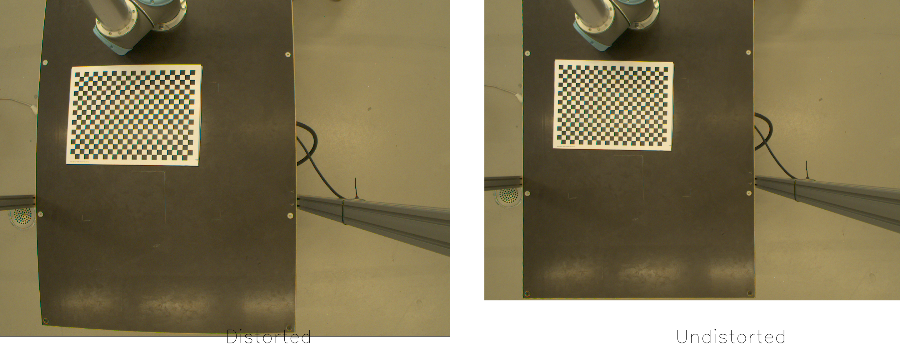

# Monocular Camera Calibration using Chessboard and OpenCV

This repository contains the code for calibrating a monocular camera using a chessboard pattern. 
The code is written in Python and uses OpenCV for camera calibration.



## Table of Contents

- [Overview](#overview)
- [Installation](#installation)
- [Usage](#usage)
- [References](#references)
- [Acknowledgements](#acknowledgements)
- [License](#license)

## Overview


A camera is a fundamental tool used across various domains, including robotics, surveillance, and entertainment. To leverage a camera effectively as a visual sensor, understanding its parameters through camera calibration is crucial.

### What is Camera Calibration?

Camera calibration is the process of estimating a camera's intrinsic and extrinsic parameters to establish a precise relationship between real-world 3D points and their corresponding 2D projections (pixels) in captured images.

### Parameters Estimated in Camera Calibration

1. **Internal Parameters**:
   - Focal length
   - Optical center
   - Radial distortion coefficients

2. **External Parameters**:
   - Rotation matrix (`R`)
   - Translation vector (`t`)

### Camera Calibration Workflow

The calibration workflow typically involves:

1. Capturing images of a known calibration pattern (e.g., checkerboard) from various viewpoints.
2. Detecting and refining the corners of the calibration pattern in the images.
3. Using the detected 2D-3D correspondences to estimate the camera's intrinsic matrix (`K`), rotation matrix (`R`), and translation vector (`t`).

### Key Components of Calibration

- **Intrinsic Matrix (`K`)**:
  - Upper triangular matrix defined by:
    ```
    K = [[f_x, 0, c_x],
         [0, f_y, c_y],
         [0, 0, 1]]
    ```
  - Contains focal lengths (`f_x`, `f_y`) and optical center coordinates (`c_x`, `c_y`).

- **Extrinsic Matrix**:
  - Composed of rotation (`R`) and translation (`t`) parameters.

### Output of Camera Calibration

- **Intrinsic Matrix (`K`)**: Represents the camera's internal properties.
- **Rotation (`R`) and Translation (`t`)**: Describe the camera's orientation and position in space.


## Installation

1. Clone the repository
2. Create a virtual environment using conda:
```bash
conda create -n camera_calibration python=3.8
```
3. Activate the virtual environment:
```bash
conda activate camera_calibration
```
4. Install the required packages:
```bash
pip install -r requirements.txt
```

## Usage

1. Capture images of the chessboard pattern from different angles and distances. Feel free to use the images provided in the **data/images** folder.
2. Run the following command to calibrate the camera:
    ```bash
    python src/main.py --chessboard_size "24,17" --square_size 0.015 
    ```
3. this will result in the following outputs:
    - The camera matrix and distortion coefficients will be saved in the **data/params** folder.
    - The undistorted images will be saved in the **data/undistorted** folder.
    - The chessboard corners will be drawn on the images and saved in the **data/corners** folder.


## References

- [OpenCV Camera Calibration Tutorial](https://docs.opencv.org/4.x/dc/dbb/tutorial_py_calibration.html)


## Acknowledgements

The utilized images are taken from the this [repository](https://github.com/niconielsen32/ComputerVision/tree/master/cameraCalibration/calibration). I would like to thank the author for providing the images.

## License

This project is licensed under the MIT License - see the [LICENSE](LICENSE) file for details.